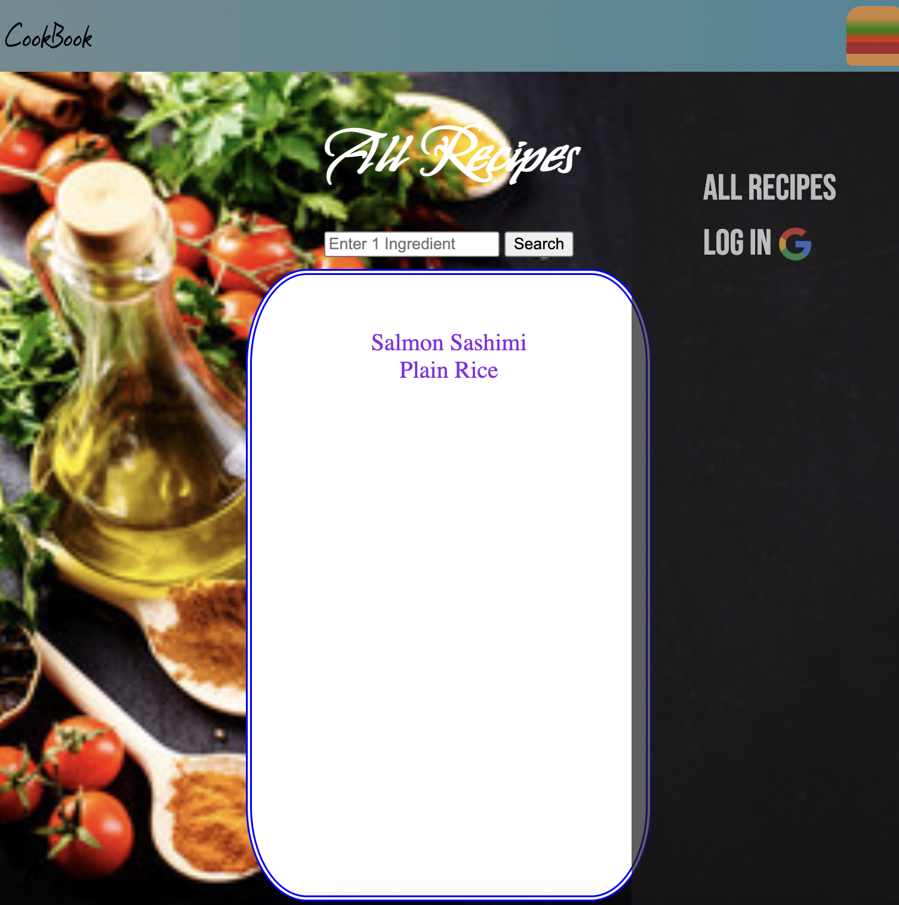
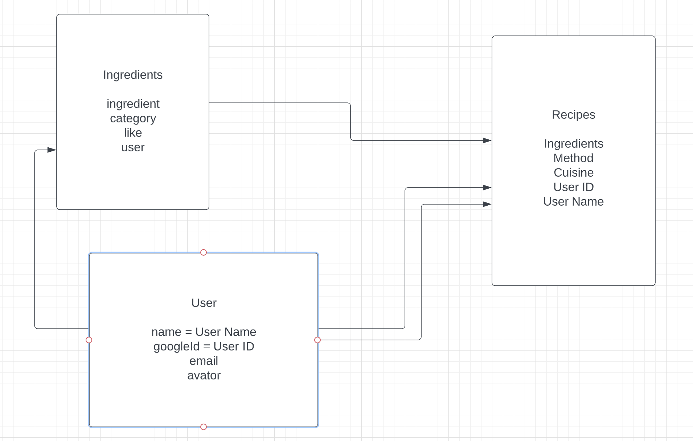

### CookBook

A cookbook that you can add/edit/delete recipes/ingredients, while look for recipes with single ingredient.

Originally want to consume 3rd-party API and to look up and record like recipes, but couldn't find the rigth API.

### Screenshot: 

### Technologies Used:
Javasciprt, EJS, CSS, HTML5, EXPRESS, MangoDB, Mangoose, OAuth2

### [DEPLOYMENT LINK](https://cookbookv1.herokuapp.com/) 

### [User Stories](https://trello.com/invite/b/w6Cd203g/8875920578428b7f31b1d4e8bfbbb8ce/project-2)

### Furture Plan

- [ ] multiple ingredients search at the same time
- [ ] include a grocery list that link to ingredients model
- [ ] comsume a third - party API. 

#### ERM

#### Route Chart

#### Wireframe

